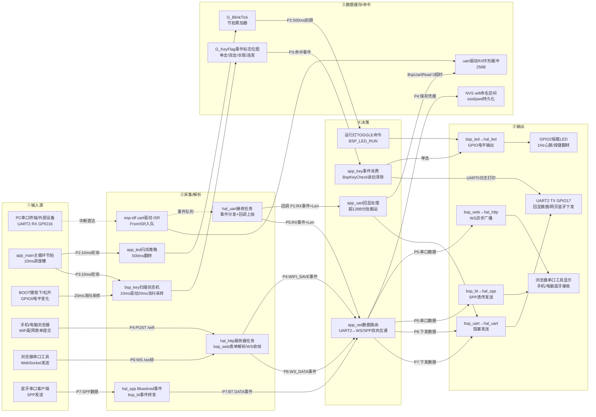

# ESP32-WROOM-32 工程功能记录

- **MCU**：ESP32-WROOM-32（SoC：ESP32-D0WDQ6，双核 Xtensa LX6 @ 240MHz，4MB Flash / 520KB SRAM）
- **SDK**：ESP-IDF **v6.1**（本机安装于 `F:\00.Code\11ESP\esp-idf`，工具链 `D:\software\31ESP`，激活脚本 `F:\00.Code\11ESP\idf-env.bat`；v5.x 亦可编译）
- **版本号规则**：`V主.次.大功能.小功能`（如 V1.0.0.0），小功能完成末位+1、大功能完成第3位+1；状态 JSON `ver` 字段与页面状态卡同步显示
- **架构**：`APP → BSP → DRV → HAL → ESP-IDF` 四层单向依赖，规范见 [Project_Level_Skill.md](Project_Level_Skill.md)
- **IDE**：VS Code（Trae）+ ESP-IDF 扩展，或 idf.py 命令行

## 目录结构

```text
ESP-32/
├── inc/                       ← 四层头文件平铺（文件名前缀区分层级）
│   ├── cfg_modules.h          ← 功能裁剪开关宏（CFG_XXX_EN）
│   ├── hal_uart.h
│   ├── hal_led.h
│   ├── hal_key.h
│   ├── hal_http.h
│   ├── hal_spp.h
│   ├── hal_wifi.h
│   ├── bsp_uart.h
│   ├── bsp_led.h
│   ├── bsp_key.h
│   ├── bsp_bt.h
│   ├── bsp_web.h
│   ├── bsp_wifi.h
│   ├── bsp_store.h
│   ├── app_uart.h
│   ├── app_led.h
│   ├── app_key.h
│   ├── app_net.h
│   ├── app_forward.h
│   ├── web_page_ported.h        ← 内置网页（由参考工程 web_page.h 自动生成 + 手工增量，勿手改结构）
│   └── app_main.h
├── src/                       ← 与 inc/ 同名对应（新增 bsp_store.c / app_forward.c）
│   ├── hal_uart.c
│   ├── hal_led.c
│   ├── hal_key.c
│   ├── hal_http.c
│   ├── hal_spp.c
│   ├── hal_wifi.c
│   ├── bsp_uart.c
│   ├── bsp_led.c
│   ├── bsp_key.c
│   ├── bsp_bt.c
│   ├── bsp_web.c
│   ├── bsp_wifi.c
│   ├── app_uart.c
│   ├── app_led.c
│   ├── app_key.c
│   ├── app_net.c
│   └── app_main.c
├── CMakeLists.txt             ← 工程构建入口
├── main/CMakeLists.txt        ← 汇总 src/*.c 到 main 组件
├── partitions.csv             ← 自定义分区表（4MB Flash：nvs 24KB + factory 3MB）
├── sdkconfig.defaults         ← 首次构建默认配置（生成 sdkconfig 后纳入版本管理）
└── Readme.md
```

## 硬件资源占用表

| 外设 | 引脚/资源 | 用途 | 归属模块 |
|------|-----------|------|----------|
| UART0 | TX=GPIO1 / RX=GPIO3，115200-8N1 | 调试口（与日志输出/固件下载复用；`BSP_UART_DBG_EN` 控制是否挂驱动，挂驱动后控制台接收被接管） | hal_uart / bsp_uart |
| UART1 | TX=GPIO18 / RX=GPIO19，115200-8N1 | 扩展口（GPIO 矩阵重映射，模组默认脚 9/10 接 Flash 不可用；`BSP_UART_EXT_EN` 控制） | hal_uart / bsp_uart |
| UART2 | TX=GPIO17 / RX=GPIO16，115200-8N1 | 通信口（**网页串口工具/蓝牙 SPP 透传口**，波特率可经网页在线修改；`BSP_UART_COMM_EN` 控制） | hal_uart / bsp_uart / app_net |
| GPIO2 | GPIO2，推挽输出 | 板载运行指示灯（DevKitC 板载 LED） | hal_led / bsp_led / app_led |
| GPIO0 | GPIO0，输入上拉，低有效 | 板载 BOOT 按键（DevKitC 板载，默认绑定；**Strapping 脚**：上电时按住进下载模式，运行期作普通按键无影响） | hal_key / bsp_key / app_key |
| WiFi | 射频（无引脚）；SoftAP `ESP32_Config`/192.168.4.1 + STA | 配网热点常开 + 凭据连接路由（NVS 持久化，断线自动重连）；**STA 联网后热点开 NAPT 中继，手机连热点即可借道上网**；与蓝牙共存（`ESP_COEX_SW_COEXIST_ENABLE`） | hal_wifi / bsp_wifi / app_net |
| BT | 射频（无引脚）；经典蓝牙 SPP 服务端 `ESP32-UART` | 蓝牙串口透传通道（手机/电脑蓝牙串口客户端接入） | hal_spp / bsp_bt / app_net |

> ESP32-WROOM-32 共 3 路硬件串口，全部已在 `bsp_uart.h` 建档（使能开关 + 波特率 + 引脚集中配置），按需启用；GPIO16/17 在 WROOM-32 上空闲，若换 WROVER 模组此两脚被 PSRAM 占用，须改引脚（改 `bsp_uart.h` 宏即可）。按键槽位与 GPIO 解耦：`app_key.h` 宏改一个 GPIO 号即可把任意空闲脚绑为按键（GPIO6~11 连接模组 Flash 被黑名单拒绝；GPIO34~39 仅输入且无内部上下拉，低有效键需外部上拉）。WiFi+蓝牙固件约 1.5MB，分区表已改 4MB Flash + factory 3MB（`partitions.csv`），从 2MB 配置升级首次烧录前建议 `idf.py erase-flash`。

## HAL 层功能记录

### hal_uart（UART 驱动，封装 ESP-IDF uart 事件队列驱动）

| 功能 | API | 说明 |
|------|-----|------|
| 串口初始化 | `HalUartInit()` | 帧格式经 `HalUartConfig_S` 可配置（波特率/数据位 5~8/校验无偶奇/停止位 1、1.5、2/流控 RTS、CTS 及引脚）；0 值字段取默认 8N1 无流控；装驱动（RX 环形缓冲 256B + 事件队列 20 深）+ 每串口接收分发任务（栈 3072B，优先级 5） |
| 串口反初始化 | `HalUartDeinit()` | 删任务、卸驱动、释放缓冲 |
| 运行时改波特率 | `HalUartSetBaud()` | 不重初始化直接更新指定串口波特率 |
| 阻塞发送 | `HalUartSend()` | 无 TX 环形缓冲直写 FIFO，`TimeoutMs` 约束等待发送完成 |
| 读取数据 | `HalUartRead()` | 从驱动环形缓冲读取，超时 0 = 立即返回已有数据 |
| 查询可读字节数 | `HalUartRxCountGet()` | 轮询场景使用 |
| 清空接收 | `HalUartRxClear()` | 清缓冲 + 复位事件队列 |
| 事件回调注册 | `HalUartSetCallback()` | 全串口共用回调按 Port 区分；事件在接收任务上下文上抛（非中断） |

事件链：`uart 驱动 ISR（ESP-IDF 内部 FromISR 入队）→ 每串口接收任务 → 回调（RX / RX_OVF / RX_FULL）`。帧间隔超时 3 符号时间触发 RX 事件。

### hal_led（LED GPIO 驱动，封装 ESP-IDF gpio 驱动）

| 功能 | API | 说明 |
|------|-----|------|
| LED 初始化 | `HalLedInit()` | 按引脚表（`hal_led.c` 内 `G_LedPinTable`）配置推挽输出并默认熄灭，可重复调用 |
| LED 状态控制 | `HalLedCtrl()` | 点亮/熄灭/翻转（TOGGLE 经电平缓存取反），`HalLed_E` 编号寻址 |

> 引脚映射集中在 `hal_led.c` 的 `G_LedPinTable`（HAL_LED_1 → GPIO2）；上层经 `HalLed_E` 枚举访问，不感知 GPIO 编号。

### hal_key（按键 GPIO 驱动，封装 ESP-IDF gpio 驱动）

| 功能 | API | 说明 |
|------|-----|------|
| 绑定任意 GPIO 为按键 | `HalKeyBind()` | 指定按键编号（`HalKey_E` 槽位）+ 任意 GPIO（0~39）+ 有效电平（低/高）；配置为输入并按有效电平使能内部上/下拉；GPIO6~11（模组 Flash）黑名单拒绝，GPIO34~39 无内部上下拉（低有效需外部上拉）；重复绑定覆盖旧绑定 |
| 读取按键电平 | `HalKeyRead()` | 非阻塞直读输入电平与有效电平比对，1=按下 / 0=松开 / -1=未绑定或参数非法；无消抖（消抖由 BSP 状态机完成） |

> 按键槽位（HAL_KEY_1~4）与 GPIO 编号完全解耦，运行时经 `HalKeyBind` 绑定任意 GPIO；上层经槽位编号访问，不感知 GPIO。

### hal_wifi（WiFi 驱动，封装 ESP-IDF esp_wifi/netif/nvs_flash，AP+STA 双模）

| 功能 | API | 说明 |
|------|-----|------|
| WiFi 初始化 | `HalWifiInit()` | 初始化 NVS/netif/esp_wifi 并启动 SoftAP+STA 双模：SoftAP 常开供配网，STA 用于连接路由器；热点配置经 `HalWifiApConfig_S`（SSID/密码/信道 1~13/最大接入 1~4），密码空串=开放热点，0 值字段取默认（信道 1 / 接入 2） |
| STA 凭据保存 | `HalWifiStaConfigSave()` | SSID/密码写入 NVS（命名空间 `wifi`，键 `ssid`/`pwd`）持久化，掉电不丢 |
| STA 凭据读取 | `HalWifiStaConfigLoad()` | 从 NVS 读回凭据（自动截断至缓冲尺寸），供上层展示/回填 |
| STA 凭据清除 | `HalWifiStaConfigClear()` | 擦除 NVS 凭据（键不存在视为已清除）；供“清除配网”接口使用 |
| STA 信号强度查询 | `HalWifiStaRssiGet()` | 当前关联 AP 的 RSSI（dBm 负值），未连接返回失败 |
| STA 发起连接 | `HalWifiStaConnect()` | 从 NVS 读凭据写入 STA 配置并连接（无凭据返回失败）；断开后可再次调用重试 |
| STA 断开 | `HalWifiStaDisconnect()` | 主动断开当前连接 |
| STA 状态查询 | `HalWifiStaStateGet()` | 返回 IDLE（无凭据/未连接）/ CONNECTING（连接中）/ CONNECTED（已获 IP） |
| STA IP 查询 | `HalWifiStaIpGet()` | 输出点分十进制 IP 字符串（含结束符最长 16B） |
| STA 收发字节查询 | `HalWifiStaTrafficGet()` | 开机累计 TX/RX 字节（数据源 `CONFIG_ESP_NETIF_REPORT_DATA_TRAFFIC` 包事件，含 NAPT 中继流量；32bit 自然回绕，上层差值法求速率）※当前固件未集成，接口随网速显示功能预留 |
| SoftAP NAT 中继 | 无新增 API（事件内自动启停） | STA 联网即开 NAPT：热点客户端报文改写源地址借道 STA 上网 + DHCP 下发 DNS（优先上游网关，退回 223.5.5.5）；STA 断开自动关闭、重连自动恢复 |
| 周边热点扫描 | `HalWifiScanGet()` | 阻塞式全信道扫描（约 1.5~3s），按 RSSI 降序同名去重，最多 20 条（SSID/信号强度/是否加密）；扫描期间 SoftAP 信标短暂停发属正常 |
| 事件回调注册 | `HalWifiSetCallback()` | GOT_IP / DISCONNECTED 事件上抛（运行于 ESP-IDF 事件任务上下文） |

事件链：`esp_wifi 驱动 → ESP-IDF 事件循环任务 → 事件回调（GOT_IP / DISCONNECTED）→ BSP 转发 APP`。STA 关联参数：认证门槛取 `WIFI_AUTH_OPEN`（任意认证模式可关联）+ PMF capable（兼容 WPA3/混合网络）。

> **NAPT 热点中继**（sdkconfig：`LWIP_IP_FORWARD` + `LWIP_IPV4_NAPT`）：STA 联网即自动开启 —— 热点客户端（192.168.4.x）经 NAPT 改写源地址借道 STA 上网，DNS 由 DHCP 下发（优先上游网关，无效退回 223.5.5.5）；STA 断开自动关闭、重连自动恢复。单射频半双工中继，预期带宽 10~20Mbps，高清视频可能缓冲。

### hal_http（HTTP/WebSocket 服务器驱动，封装 ESP-IDF esp_http_server，双实例架构）

| 功能 | API | 说明 |
|------|-----|------|
| 服务器初始化 | `HalHttpInit()` | 启动**双实例**：实例1（80 端口：内置页+/api 接口，并发 4）；实例2（81 端口：WebSocket 专用，并发 4，ctrl_port 32769 与实例1区分，send_wait_timeout=1s）；socket 总预算 `CONFIG_LWIP_MAX_SOCKETS=16` |
| URI 注册 | `HalHttpUriRegister()` | 按 `HalHttpUri_S` 注册路径+方法（GET/POST/WS）+回调；**WS 路由自动注册到 81 端口实例**；配置须长期保活（建议常量/静态存储） |
| 请求体长度 | `HalHttpReqContentLen()` | POST 请求体长度（字节） |
| 请求体接收 | `HalHttpReqContentRecv()` | 读 POST 请求体到调用方缓冲（表单解析用） |
| 请求应答 | `HalHttpReqRespond()` | 按 HTTP 状态码/Content-Type/响应体回复 |
| WebSocket 收帧 | `HalHttpReqWsRecv()` | 读一帧 WS 数据；超长帧自动丢弃不阻塞 |
| WebSocket 推送 | `HalHttpWsPush()` | 向**全部在册且握手完成**的 WS 连接推二进制帧（跨任务安全但可能阻塞，勿在主循环/事件任务高频调用） |
| WebSocket 文本推送 | `HalHttpWsPushText()` | 同上，推文本帧（JSON 状态用） |

> **WS 连接登记表机制**：81 实例配 `open_fn/close_fn` 回调精确登记/注销连接 fd（fd 号为 VFS 全局分配不可盲扫，实测可达 57）；`ws_post_handshake_cb` 钩子（需 `CONFIG_HTTPD_WS_POST_HANDSHAKE_CB_SUPPORT=y`）标记握手完成——**IDF 握手时不调 URI 处理器**，握手未完成前推送会打乱 101 响应故设就绪门控；**推送失败≠会话死亡不注销**（超时/窗口满仅暂时不可达），注销只由 close_fn 唯一负责，否则洪水期一次超时就把活连接踢出名单致显示永久停止。`HalHttpReq_S` 的 `pRaw` 为厂商句柄占位，上层保持 opaque。

### hal_spp（经典蓝牙 SPP 驱动，封装 ESP-IDF Bluedroid SPP，服务端模式）

| 功能 | API | 说明 |
|------|-----|------|
| SPP 初始化 | `HalSppInit()` | 初始化 BT 控制器（CLASSIC_BT）+ Bluedroid 协议栈 + SPP 增强模式，并以服务端身份启动 SPP 服务（异步，INIT 事件内拉起）被动等待客户端接入；入参设备名/服务名 |
| SPP 发送 | `HalSppSend()` | 向已连接客户端发数据；未连接返回 -2，链路拥塞（CONG）返回 -3 暂缓重发 |
| 连接状态查询 | `HalSppIsConnected()` | 1=已连接 / 0=未连接 |
| 事件回调注册 | `HalSppSetCallback()` | OPENED / CLOSED / DATA 事件上抛（运行于 Bluedroid 事件任务上下文） |

事件链：`BT 控制器 → Bluedroid 事件任务 → SPP 回调（OPENED/CLOSED/DATA）→ BSP 转发 APP`；单连接模型，新客户端接入自动接管旧连接。

## BSP 层功能记录

### bsp_uart（板载串口封装：覆盖全部 3 路硬件串口）

| 功能 | API | 说明 |
|------|-----|------|
| 板载串口初始化 | `BspUartInit()` | 按 `bsp_uart.h` 使能宏（`BSP_UART_DBG_EN`/`BSP_UART_EXT_EN`/`BSP_UART_COMM_EN`）逐路初始化 DBG（UART0）/EXT（UART1）/COMM（UART2），波特率/引脚集中在 `bsp_uart.h` 配置，帧格式默认 8N1；先挂事件转发再逐路 Init，某路失败不阻断其余路 |
| 板载串口反初始化 | `BspUartDeinit()` | 指定路转调 `HalUartDeinit()`，卸驱动释放资源 |
| 运行时改波特率 | `BspUartSetBaud()` | 指定路转调 `HalUartSetBaud()`，不重初始化 |
| 语义串口发送 | `BspUartSend()` | `BspUart_E` 语义号（DBG/EXT/COMM）经映射表转发对应硬件串口 |
| 语义串口读取 | `BspUartRead()` | 同上 |
| 查询可读字节数 | `BspUartRxCountGet()` | 同上 |
| 清空接收 | `BspUartRxClear()` | 指定路清接收缓冲 + 复位事件队列 |
| 事件回调注册 | `BspUartSetCallback()` | 接收 HAL 事件（反查映射表）转为带 Port 号的板级语义事件转发 APP |

### bsp_led（板载灯封装）

| 功能 | API | 说明 |
|------|-----|------|
| 板载灯初始化 | `BspLedInit()` | 转调 HAL LED 初始化 |
| 板载灯设置 | `BspLedSet()` | 语义灯号/状态（`BspLed_E`/`BspLedState_E`）→ HAL 硬件灯号映射输出 |

> 语义映射集中在 `bsp_led.c`：`BSP_LED_RUN`（运行灯）→ `HAL_LED_1`（GPIO2 板载灯）。LED 为 GPIO 直控器件，无 DRV 层（第 2 节注）。

### bsp_key（按键消抖扫描状态机：按住/按下/松开/单击/双击/长按/连发事件识别）

| 功能 | API | 说明 |
|------|-----|------|
| 按键模块初始化 | `BspKeyInit()` | 复位全部按键状态机，清空绑定与事件标志 |
| 绑定任意 GPIO 为按键 | `BspKeyBind()` | 转调 `HalKeyBind` 并复位该键状态机；返回 0 成功 / -1 参数 / -2 裁剪 / -3 HAL 失败 |
| 扫描状态机 | `BspKeyTick()` | 须由 APP 以 10ms（`BSP_KEY_TICK_PERIOD_MS`）周期调用；内部 20ms（`BSP_KEY_SCAN_PERIOD_MS`）消抖采样，事件识别方式与 Doc/drv_key 标志位状态机一致；未绑定按键自动跳过 |
| 查询消费按键事件 | `BspKeyCheck()` | 传入事件标志（`BSP_KEY_HOLD/DOWN/UP/SINGLE/DOUBLE/LONG/REPEAT`，可按位或）查询，命中返回 1 并清除已消费标志（HOLD 为电平态不清除）；0 未命中 |
| 长按阈值配置 | `BspKeyTimeLongSet()` | 运行时修改长按判定时间（默认 3000ms，双击窗口 50ms / 连发周期 100ms 在 `bsp_key.h` 宏配置） |

> 按键为 GPIO 直控器件，无 DRV 层（第 2 节注），BSP 直达 HAL；状态机移植自 Doc/drv_key（0~4 态：空闲→按下→双击窗口→双击松开→长按连发），事件标志 0x01~0x40 与参考实现一致。

### bsp_wifi（板载 WiFi 封装：配网热点参数 + 自动重连组织）

| 功能 | API | 说明 |
|------|-----|------|
| WiFi 模块初始化 | `BspWifiInit()` | 以 `bsp_wifi.h` 集中定义的热点参数（SSID `ESP32_Config`/密码 `12345678`/信道 6/接入 2）初始化 AP+STA 双模；NVS 有凭据则自动发起 STA 连接 |
| 配网凭据下发 | `BspWifiConfigSet()` | 保存 SSID/密码到 NVS 并连接（网页表单提交路径）；IDLE 态直接发起，连接中/已连接态先断开、由断开事件回调自动以新凭据重连（规避 disconnect 未完成即 connect 的状态冲突） |
| 当前 SSID 查询 | `BspWifiConfigSsidGet()` | 从 NVS 读回已配网 SSID（状态栏展示用） |
| 完整凭据读取 | `BspWifiConfigGet()` | 读回完整 SSID+密码（配网接口失败时恢复原配置用） |
| 凭据清除 | `BspWifiConfigClear()` | 擦除 NVS 凭据（“清除配网”接口，清除后重启回纯热点待配网态） |
| 信号强度查询 | `BspWifiStaRssiGet()` | 当前关联 AP 的 RSSI（dBm 负值），未连接返回失败 |
| 周边热点扫描 | `BspWifiScanGet()` | 转发 HAL 扫描（阻塞 1.5~3s，最多 20 条）；扫描期间挂起自动重连（扫描与关联互斥），扫描结束恢复连接尝试 |
| STA 状态查询 | `BspWifiStaStateGet()` | IDLE / CONNECTING / CONNECTED 板级语义 |
| STA IP 查询 | `BspWifiStaIpGet()` | 点分十进制 IP 字符串 |
| STA 收发字节查询 | `BspWifiStaTrafficGet()` | ※当前固件未集成（随网速显示功能预留） |
| 事件回调注册 | `BspWifiSetCallback()` | GOT_IP / DISCONNECTED 事件转发 APP；**断线时本层自动重连**（DISCONNECTED 事件内重发 `HalWifiStaConnect`，重试上限 `BSP_WIFI_RETRY_MAX`=20 次防密码错误死循环，GOT_IP 清零计数） |

> WiFi 为片上外设，无 DRV 层（第 2 节注），BSP 直达 HAL；热点参数集中在 `bsp_wifi.h`，换板改此处。

### bsp_web（板载网页封装：暗色单页三标签 + /api 接口 + WS 通道，参照 ESP8266-develop 工程）

| 功能 | API | 说明 |
|------|-----|------|
| 网页模块初始化 | `BspWebInit()` | 启动双实例 HTTP 服务器并注册 9 路由：GET `/`（内置暗色单页：**配网/串口终端/转发**三标签，GitHub 风格，由参考工程 web_page.h 自动生成于 `web_page_ported.h`）；GET `/api/status`（状态 JSON）、GET `/api/scan`（扫描列表 ssid/rssi/secure）；POST `/api/wifi`（同步等连接 12s，失败恢复原配置）、POST `/api/serial`（波特率 300~2000000 + NVS 持久化）、POST `/api/forward`（转发配置+蓝牙开关）、POST `/api/reboot`、POST `/api/resetwifi`（清凭据+延时重启）；WS `/`（81 端口数据通道） |
| 事件回调注册 | `BspWebSetCallback()` | 上抛 3 类事件：WS_OPEN / WS_DATA（网页终端发送数据）/ FORWARD_SET（转发配置提交，格式 `proto\nip\nport\nbt`）；回调运行于 HTTP 服务器任务上下文 |
| 状态提供者注册 | `BspWebStatusProviderSet()` | APP 层注册回调供 `/api/status` 拉取实时状态 JSON（避免 BSP 反向依赖 APP） |
| WS 二进制广播 | `BspWebWsBroadcast()` | 向全部在册且握手完成的连接推二进制帧（内部经 HAL 登记表定向，单次调用即达全部） |
| WS 文本广播 | `BspWebWsBroadcastText()` | 同上推文本帧（状态 JSON 用） |

> 页面 JS 3s 轮询 `/api/status` + WS 文本推送双路刷新状态卡（模式/SSID/IP/信号强度/波特率/内存/运行时长/收发字节/转发状态）；`/api/wifi` 同步阻塞等待（vTaskDelay 让出 CPU 保证 WiFi 事件推进）；`/api/reboot` 与 `/api/resetwifi` 应答后经 esp_timer 延时 500ms 重启（先送响应再重启）；表单经 URL 解码（`%XX` 与 `+`）拆字段。

### bsp_bt（板载蓝牙封装：经典蓝牙 SPP 透传通道）

| 功能 | API | 说明 |
|------|-----|------|
| 蓝牙模块初始化 | `BspBtInit()` | 以 `bsp_bt.h` 集中定义的设备名 `ESP32-UART` / 服务名 `ESP32_SPP` 启动 SPP 服务端，等待手机/电脑蓝牙串口客户端接入 |
| SPP 发送 | `BspBtSppSend()` | 向已连接客户端透传数据 |
| 连接状态查询 | `BspBtSppIsConnected()` | 1=已连接 / 0=未连接 |
| 事件回调注册 | `BspBtSetCallback()` | OPENED / CLOSED / DATA 事件转发 APP（DATA 数据仅回调期间有效） |

> 蓝牙为片上外设，无 DRV 层（第 2 节注），BSP 直达 HAL；与 WiFi 共存依赖 `CONFIG_ESP_COEX_SW_COEXIST_ENABLE` 软件共存。

### bsp_store（板载配置存储封装：NVS 键值对，对应参考工程 LittleFS /config.txt 机制）

| 功能 | API | 说明 |
|------|-----|------|
| 存储初始化 | `BspStoreInit()` | 打开 NVS 命名空间 `xcom`（句柄常开复用；须在 WiFi 初始化（NVS 就绪）后调用） |
| 字符串写入/读取 | `BspStoreSetStr()` / `BspStoreGetStr()` | 键值对字符串，写入立即 commit 持久化 |
| 整型写入/读取 | `BspStoreSetU32()` / `BspStoreGetU32()` | 32 位无符号整型，读取无键返回默认值 |

> 当前存储键：`baud`（波特率）、`fwproto`/`fwip`/`fwport`（转发配置）、`btsw`（蓝牙转发开关）；WiFi 凭据仍在 `wifi` 命名空间由 hal_wifi 管理。

## APP 层功能记录

### app_uart（串口回显业务）

| 功能 | API | 说明 |
|------|-----|------|
| 业务初始化 | `AppUartInit()` | 注册回调 + 初始化板载串口（`BspUartInit` 按使能宏逐路），回显业务挂 COMM 口；`CFG_APP_NET_EN=1` 时通信口回调在 `AppNetInit` 末尾被 app_net 接管（本业务退化为 EXT/DBG 口可用） |
| 事件处理 | `AppUartEventHandler()`（内部） | RX/RX_FULL 事件读取数据原样回发，单帧超 128B 分批搬运 |
| 业务发送 | `AppUartSend()` | 对外上报/应答统一出口（转 BSP 通信口） |

### app_led（LED 闪烁策略）

| 功能 | API | 说明 |
|------|-----|------|
| 业务初始化 | `AppLedInit()` | 转调 BSP 板载灯初始化 |
| 闪烁策略处理 | `AppLedBlinkProcess()` | 运行灯 1Hz 心跳（500ms 翻转一次），按主循环调度周期累加节拍 |

### app_key（按键事件消费业务）

| 功能 | API | 说明 |
|------|-----|------|
| 业务初始化 | `AppKeyInit()` | 初始化 BSP 按键模块并按 `app_key.c` 顶部宏（`APP_KEY_1_GPIO_NUM`/`APP_KEY_1_ACTIVE_LOW`）绑定默认按键（BSP_KEY_1 → GPIO0 BOOT 键，低有效）；换绑任意 GPIO 只改该宏；绑定失败打印告警不阻断启动 |
| 扫描驱动与事件消费 | `AppKeyProcess()` | 先驱动 `BspKeyTick()` 扫描状态机，再消费事件：单击翻转运行灯 + 打印，双击/长按/连发打印事件名（演示用，用户在此挂自己的业务） |

### app_net（网络业务：WiFi 配网 + 网页串口终端 + 转发 + 蓝牙的数据路由中枢）

| 功能 | API | 说明 |
|------|-----|------|
| 业务初始化 | `AppNetInit()` | 依次拉起 bsp_wifi → bsp_store（加载持久化波特率/蓝牙开关并应用）→ bsp_web（注册事件回调 + 状态提供者 + 创建 ws_tx 发送任务）→ bsp_bt → 接管 UART0/UART2 回调 → app_forward（按持久化配置恢复转发通道） |
| 周期处理 | `AppNetProcess()` | 主循环槽：转发通道轮询（TCP 重连/收数据 + UDP 收数据）+ NTP 首次成功日志；**不含任何 WS 推送**（全部在 ws_tx 任务，防阻塞发送冻结主循环） |
| WS 发送任务 | `AppNetWsTxTask()`（内部） | 专职任务（10ms 节拍）：合批排水 + 发送回显排水 + 状态推送（3s 周期/事件请求）；所有可能阻塞的 WS 推送集中于此，慢客户端仅延迟显示不冻结系统 |
| 合批缓冲追加 | `AppNetWsTxAppend()` | 串口/转发入向/回显数据先入乒乓双缓冲（512B×2，跨任务安全）；满 30ms 或缓冲将满时合并为一帧广播（防 10ms 级高频逐帧推送卡顿） |

**数据路由规则**（本模块为五条业务通路的中枢）：

| 输入事件 | 路由动作 |
|---------|---------|
| UART2/UART0 RX（外部串口设备/COM15 → ESP32） | 三路转发：① 经合批缓冲 → WS 广播到网页终端；② SPP 发给已连接蓝牙客户端（受蓝牙转发开关控制，NVS 持久化默认关）；③ 网络转发推送（AppForwardPush）；收发计数累加 |
| WS_DATA（网页终端发送） | 写 UART2 + UART0 TX（COM15 串口助手可见）+ 同步网络转发 + 经回显缓冲广播回终端（发送可见） |
| BT DATA（蓝牙客户端发送） | 写 UART2 TX（到达外部串口设备） |
| FORWARD_SET（转发配置提交） | 拆四段 `proto\nip\nport\nbt`：蓝牙开关立即生效并持久化；转发参数交 app_forward 校验/持久化/应用 |
| WS_OPEN（新网页连接） | 不做即时推送（3s 周期推送兜底；握手上下文推送会死锁服务器任务） |

> 状态 JSON 与参考工程 `/api/status` 字段一致：`ver/mode/ssid/ip/rssi/heap/baud/uptime/rx/tx/ws/fwproto/fwip/fwport/fwup/fwrx/fwtx/bt`（3s 周期 + WS 文本推送双路刷新页面状态卡）。WS 与蓝牙之间不互转（均为远端，仅与串口互通），避免回环。

### app_forward（串口转发业务：UART2 ↔ TCP 客户端/UDP 双向透传，参照 ESP8266-develop 工程移植）

| 功能 | API | 说明 |
|------|-----|------|
| 初始化恢复 | `AppForwardInit()` | 从 NVS 加载转发配置（fwproto/fwip/fwport）并按上次配置恢复通道 |
| 配置设置 | `AppForwardConfigSet()` | 校验（IP 格式/端口 1~65535）+ NVS 持久化 + 立即应用（关闭旧通道建新通道） |
| 轮询 | `AppForwardPoll()` | 主循环槽（10ms）：TCP 非阻塞连接 select 探测 + 2s 重连；网络入向数据 → 写 UART2 + 经合批缓冲显示到网页终端 + 计数 |
| 串口→网络 | `AppForwardPush()` | 串口 RX 数据推送到网络目标（TCP 已连接才发，未连接丢弃；UDP 直接 sendto，本地绑 INADDR_ANY 对称端口） |
| 状态查询 | `AppForwardXxxGet()` 系列 | proto/ip/port/up/rx/tx 供状态 JSON 组装（TCP up=已连接，UDP up=socket 已建） |

> 转发目标必须是设备可达地址（VMware 虚拟网卡等本机专用网段路由不到，UDP 无连接故“已连接”但丢包、TCP 诚实报连不上）；网络入向数据同时写入串口与网页终端显示（双向可视）。

### app_main（应用入口与主调度）

| 功能 | API | 说明 |
|------|-----|------|
| 启动调度 | `app_main()` | 打印横幅 → 初始化业务模块（按开关宏裁剪，app_net 网络业务最后初始化：蓝牙协议栈装载阻塞数秒属正常）→ 主循环按 `APP_MAIN_PROCESS_PERIOD_MS`（10ms）周期轮询各业务槽 |
| 调度周期 | `APP_MAIN_PROCESS_PERIOD_MS` 宏 | 主循环节拍（10ms），各业务 Process 须非阻塞 |

## 硬件号数据流转

**数据通路清单表**：

| 通路 | ①输入源 | ②采集/解析 | 触发·频率 | ③数据落点 | ④消费方 | ⑤输出 |
|------|---------|-----------|----------|----------|---------|-------|
| P1 通信串口 | 外部设备/PC 终端 → UART2 RX（GPIO16） | esp-idf uart 驱动 ISR + hal_uart 接收任务事件分发 | 中断触发（帧间隔超时 3 符号 / 缓冲阈值） | uart 驱动 RX 环形缓冲 256B | app_uart 回显处理（回调上下文） | bsp_uart → hal_uart → UART2 TX（GPIO17）原样回发 |
| P2 运行灯 | 调度节拍（app_main 主循环 10ms） | app_led 闪烁策略（500ms 到期翻转） | 1Hz 槽（主循环轮询，非阻塞） | G_BlinkTick 节拍累加器 | app_led 闪烁策略 | bsp_led → hal_led → GPIO2 板载灯亮灭 |
| P3 按键 | BOOT 键按下/松开（GPIO0 电平变化） | bsp_key 扫描状态机（`BspKeyTick` 主循环 10ms 驱动，20ms 消抖采样，识别单击/双击/长按/连发） | 轮询槽（主循环轮询，非阻塞） | G_KeyFlag 每键事件标志（0x01~0x40 位图） | app_key 事件消费（`BspKeyCheck` 消费型读取） | 单击 → bsp_led → hal_led 翻转 GPIO2 运行灯 + UART0 日志打印事件 |
| P4 WiFi 配网 | 手机/电脑连接热点 `ESP32_Config` → 浏览器提交表单（POST /wifi） | hal_http 服务器任务 + bsp_web 表单解析（URL 解码 + 字段拆分 `ssid\npwd`） | 浏览器请求触发 | 事件回调参数（栈上透传） | app_net 配网处理（`BspWifiConfigSet`） | bsp_wifi → hal_wifi → NVS 持久化 + STA 连接路由器；页面重定向回首页 |
| P5 串口→网页 | 外部串口设备/COM15 → UART2/UART0 RX | esp-idf uart 驱动 ISR + hal_uart 接收任务事件分发 | 中断触发（帧间隔超时 3 符号） | uart 驱动 RX 环形缓冲 256B | app_net 串口路由（256B 分批） | ① 经合批缓冲（30ms 合帧）→ ws_tx 任务 → WS 广播显示；② bsp_bt → hal_spp → 蓝牙客户端（蓝牙开关控制）；③ app_forward → TCP/UDP 目标 |
| P6 网页→串口 | 浏览器串口终端发送（WS 帧） | hal_http WS 收帧 + bsp_web 事件上抛 | 浏览器发送触发 | 事件回调参数（仅回调期间有效） | app_net 网页路由 | bsp_uart → UART2+UART0 TX（COM15 串口助手可见）+ app_forward 同步转发 + 回显缓冲→终端显示 |
| P7 蓝牙→串口 | 手机/电脑蓝牙串口客户端发送（SPP） | hal_spp Bluedroid 事件任务 + bsp_bt 事件转发 | 蓝牙接收触发 | 事件回调参数（仅回调期间有效） | app_net 蓝牙路由 | bsp_uart → hal_uart → UART2 TX（GPIO17）到达外部串口设备 |
| P8 网络转发（双向） | UART2 RX ↔ TCP/UDP 目标 | app_forward 轮询（非阻塞 connect+select 探测，2s 重连） | 主循环 10ms 槽 | 合批缓冲（显示路径） | app_net / app_forward | 串口→网络：send/sendto；网络→串口：recv 后写 UART2 + 终端显示 + 计数 |

**分阶段流程图**：



> 虚线 `-.->` = 中断直达；实线 `-->` = 任务上下文阻塞/轮询。日志通路（UART0）为系统通路，不计入特性表。
>
> 下图为基础通路示意；串口→蓝牙/网络转发与 30ms 合批机制见上方通路表（P5/P8）。

## 构建与烧录

```powershell
# VS Code ESP-IDF 扩展：配置扩展指向 ESP-IDF 安装目录后，用底部状态栏 Build/Flash/Monitor
# 命令行（每个新终端先激活环境）：
cd <ESP-IDF安装目录>; .\export.bat
cd f:\00.Code\11ESP\ESP-32
idf.py set-target esp32      # 首次（生成 sdkconfig；sdkconfig.defaults 已指定 esp32，亦可直接 build）
idf.py build
idf.py -p COMx flash monitor # COMx 换实际串口号，退出监视 Ctrl+]
idf.py size                  # 资源占用检查（结果回填 Project_Level_Skill.md 13.4 节）
```

## 功能验证（回显 Demo）

1. USB-TTL 模块：TX→GPIO16，RX→GPIO17，GND 共地（注意**不要**接模组 GPIO1/3，那是日志/下载口）
2. PC 串口助手打开 USB-TTL 对应串口，115200-8N1
3. 烧录后日志口（UART0，板载 USB 转串口，115200）打印 `[app_uart] comm port ready`
4. 串口助手发送任意字符串（≤128B 一次回完，更长分批），收到相同内容即通路正常

## 功能验证（按键 Demo）

1. 无需接线：默认按键绑定 DevKitC 板载 BOOT 键（GPIO0，低有效）
2. **单击** BOOT 键：GPIO2 运行灯翻转，日志口打印 `[app_key] key1 single: toggle led`
3. **双击**（间隔 <50ms+50ms 窗口）：打印 `[app_key] key1 double`
4. **长按** ≥3s：打印 `[app_key] key1 long`，继续按住每 100ms 打印 `[app_key] key1 repeat`
5. 换绑任意 GPIO：改 `app_key.c` 顶部 `APP_KEY_1_GPIO_NUM` 宏（或运行时调 `BspKeyBind`），注意 GPIO6~11 黑名单与 GPIO34~39 无内部上下拉约束

## 功能验证（WiFi 配网 / 网页串口 / 蓝牙 Demo）

**准备**：USB-TTL 模块 TX→GPIO16 / RX→GPIO17 / GND 共地（同回显 Demo 接线）；烧录后热点 `ESP32_Config`（密码 `12345678`）自动开启，日志口打印 `[app_net] ...` 系列。

**① WiFi 网页配网（扫描列表选择）**：

1. 手机/电脑连接热点 `ESP32_Config`，浏览器访问 `http://192.168.4.1` → 暗色单页（**配网 / 串口终端 / 转发**三标签，GitHub 风格）
2. 配网页签点“扫描”（约 2~3s）→ 列表按信号强度排列（ESP32 仅支持 2.4GHz；5GHz 频段的 SSID 物理不可连）
3. 选择路由器（SSID 自动填入）→ 输密码 → 点“连接”（同步等待最长 12s）：成功显示 IP，失败自动恢复原配置并提示
4. 重启 ESP32 验证凭据持久化：自动连接无需再配网

> 注：密码错误时重试 20 次后停止自动重连（防死循环），重新提交正确密码即可；也可不经扫描直接手动输入 SSID。

**② 网页串口终端（四路数据源）**：

1. 切到“串口终端”标签自动建立 WebSocket（81 端口）；状态卡 3s 自动刷新（模式/SSID/IP/信号强度/波特率/可用内存/运行时长/收发字节/转发状态）
2. 接收区显示四路数据：UART2 设备数据、COM15（调试口）数据、网页发送回显、**网络转发入向数据**（30ms 合帧防高频卡顿）
3. 发送区输入 → 点发送 → UART2 与 COM15 串口助手**同时**收到，且同步走网络转发
4. 页面可改波特率（300~2000000），NVS 持久化重启保留

**③ 蓝牙 SPP 透传（含转发开关）**：

1. 手机安装蓝牙串口 App（如 Serial Bluetooth Terminal），搜索并连接 `ESP32-UART`（**已配对过的设备在“已配对列表”里，不会出现在搜索列表**）
2. 日志打印 `[bsp_bt] spp opened`
3. **转发页签开启“蓝牙转发”开关并保存**（默认关）→ 串口数据同步推到手机 App（串口→蓝牙）
4. 手机 App 发数据 → 串口助手收到（蓝牙→串口，不受开关影响）；开关状态 NVS 持久化

> **无线环境使用法则（实测踩坑）**：模块插在电脑上或靠近路由器时，电脑 WiFi/USB3.0 噪声与路由器 2.4GHz 会把蓝牙可发现距离从正常 10 米+压缩到约 0.5 米——现象为“搜索时有时无/搜不到”，易误判为固件或硬件故障。**用蓝牙时让模块离开电脑/路由器 1 米以上**。排查路径：①官方例程交叉验证（排除代码）→ ②SDP 直连查询（区分射频通/断）→ ③距离梯度测试（0.5m/2-3m）→ ④充电宝隔离测试（区分干扰 vs 硬件）。另：SPP 服务注册会复位 GAP 设置，设备名/可发现模式须在 `esp_spp_start_srv` 后重新应用。

**④ 热点上网（NAT 中继）**：

1. 前提：① 配网完成且日志已打印 `[app_net] wifi connected`（NAPT 自动开启，日志见 `[hal_wifi] nat on: ap clients online via sta (dns ...)`）
2. 手机**关闭移动数据**，连接热点 `ESP32_Config`；若此前连过须先“忘记此网络”再连（重新获取 DHCP 下发的 DNS）
3. 浏览器打开任意网站应正常加载；短视频 App 可正常刷（单射频中继，预期 10~20Mbps，高清可能缓冲）
4. STA 断网（如关路由器）：热点与 192.168.4.1 配网页仍可用，仅外网断开；路由恢复后 NAPT 自动重开

**⑤ TCP/UDP 转发（UART2 ↔ 网络目标双向透传）**：

1. 转发页签 → 模式选 **TCP 客户端** 或 **UDP** → 填目标 IP 与端口（目标必须是设备可达地址）→ 保存（NVS 持久化重启恢复）
2. UART2/COM15 收到的数据实时转发到目标；目标发来的数据写入 UART2 并同步显示在网页终端（双向可视）
3. 验证：PC 网络调试助手本地监听地址绑 `0.0.0.0`，目标填 PC 局域网 IP → 串口助手发数据到网络助手、反向发送到串口
4. 注意：目标不可达时 TCP 显示“未连接”（诚实），UDP 无连接概念显示已连接但丢包；VMware 虚拟网卡等本机专用网段地址不可作目标；TCP 断开后 2s 自动重连

## MCU 移植提示

更换 MCU（如 ESP32-S3/C3）仅需重写 `hal_uart.c` / `hal_led.c` / `hal_key.c` 内部实现（接口签名不变）+ 调整 `bsp_uart.h` / `hal_led.c` 引脚映射（`hal_key` 无引脚表，任意 GPIO 运行时绑定）；上层 BSP/APP 零改动（见 Project_Level_Skill.md 第 10 节）。

网络功能同理：更换带 WiFi/BT 的其他 ESP 型号重写 `hal_wifi.c` / `hal_http.c` / `hal_spp.c` 内部实现（接口签名不变）；无 WiFi/BT 的 MCU 将 `cfg_modules.h` 对应 `CFG_HAL_*`/`CFG_BSP_*`/`CFG_APP_NET_EN` 置 0，全部模块自动降级为空实现，其余业务不受影响。
