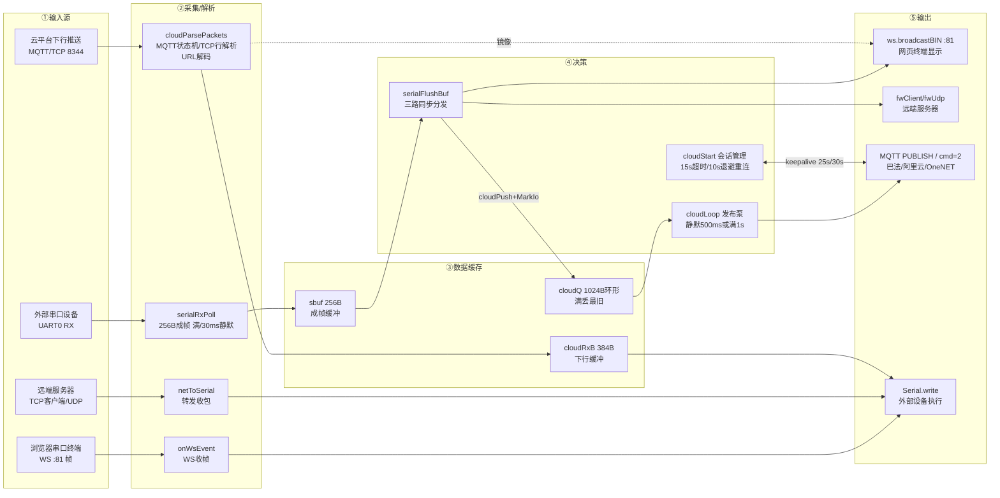

# ESP8266-XCOM 串口 WiFi 透传器 工程功能记录

- **MCU**：ESP8266（NodeMCU v2，板载 CH340 USB 转串口，WiFi 仅 2.4GHz）
- **SDK**：PlatformIO + Arduino 框架（env `nodemcuv2`，LittleFS，唯一外部库 links2004/WebSockets）
- **定位**：串口 ↔ WiFi 双向透传 + 物联网云桥（设备串口数据上云，云下行写回串口）
- **仓库**：ESP8266（master/develop 同步，当前 stage4.2+）；远程经 SSH 别名 `git@github-esp8266`
- **架构铁律**：串口=数据通道，**生产固件禁止任何 DBG/调试打印**；AP 热点常开 + 全异步（主循环非阻塞）

## 目录结构

```text
src/
├── main.cpp      ← 应用层：配网/状态机/网页路由/串口成帧/三路分发/转发客户端/LED
├── web_page.h    ← 单页门户（PROGMEM 内置 HTML/JS，4 标签：配网/串口终端/转发/物联网平台）
├── cloud.h       ← 云抽象层：4 平台×3 接入方式，手工组 MQTT 报文 + BearSSL TLS
platformio.ini    ← nodemcuv2 / littlefs / WebSockets@^2.4.1
README.md         ← 仓库门面（特性简介 + 快速开始）
```

## 硬件资源占用表

| 外设 | 引脚/资源 | 用途 | 归属模块 |
|------|-----------|------|----------|
| UART0 | GPIO1(TX)/GPIO3(RX)，默认 115200-8N1（网页在线改，存 LittleFS） | 数据口：透传通道，**挂生产业务，禁止打印** | main.cpp 串口透传 |
| GPIO2 | 板载 LED，低电平点亮 | 状态指示：STA 在线每 2s 短亮心跳 / 仅 AP 慢闪 200ms / 连接中快闪 80ms | main.cpp `ledLoop()` |
| WiFi | 射频；AP `ESP8266-XCOM-xxxx` @192.168.4.1 常开 + STA | AP 供配网/内网访问，STA 连路由（凭据持久化，断线自动重连） | main.cpp / web_page.h |
| HTTP | 80 端口 ESP8266WebServer | 单页门户 + 8 个 API 路由；**首页必须发 `Cache-Control: no-store`** | main.cpp `server.on(...)` |
| WebSocket | 81 端口 WebSocketsServer | 网页串口终端二进制通道（串口数据广播 / 网页下发） | main.cpp `onWsEvent` |
| LittleFS | `/config.txt`（key=value 全部配置） | 配网/串口/转发/云平台配置持久化，掉电不丢 | main.cpp `cfgLoad/cfgSave` |
| mDNS | `xcom.local` | 局域网域名（辅助发现） | main.cpp |

## 网页 API 记录

| 方法 | 路由 | 参数 | 说明 |
|------|------|------|------|
| GET | `/` | — | 内置单页门户（no-store 头，防升级后浏览器旧缓存瘫页） |
| GET | `/api/status` | — | 全量状态 JSON（ver/wifi/ip/led/baud/fw*/cloud*/cloudtag/clouderr/cloudrc/tx/rx/heap） |
| GET | `/api/scan` | — | 异步扫描周边热点（首次 202+空表，再次取结果；不阻塞 AP 信标） |
| POST | `/api/wifi` | ssid&pass | 连接并持久化 |
| POST | `/api/serial` | baud | 在线改波特率并持久化 |
| POST | `/api/forward` | proto(0/1/2)&ip&port | 转发配置：0 关 / 1 TCP 客户端 / 2 UDP |
| POST | `/api/cloud` | proto(0/1/2/3)&tra&pk&id&ps… | 云平台配置；变更即生效（`cloudApply` 断开重连） |
| POST | `/api/reboot` | — | 重启 |
| POST | `/api/resetwifi` | — | 清配网重启（回 AP 模式） |
| WS | `:81` | 二进制帧 | 串口终端双向通道；网页下发帧直写 UART0 |

> 注意：固件只注册 GET/POST 实际用到的方法，`curl -I`（HEAD 请求 `/`）返回 404 属正常现象。

## 串口透传层功能记录（main.cpp）

| 功能 | 函数 | 说明 |
|------|------|------|
| 串口接收成帧 | `serialRxPoll()` | 轮询 UART0 RX 写入 256B 成帧缓冲 `sbuf`；**满缓冲立即成帧 + 首字节起 30ms 静默成帧**（帧间隔聚合，兼顾低延迟与批处理效率） |
| 三路同步分发 | `serialFlushBuf()` | 一帧串口数据同时：① `ws.broadcastBIN` 网页终端 ② `forwardPush` 转发客户端 ③ `cloudPush` 云上行队列；并累计 `rxCount` |
| 网络下行写回 | WS 事件 / `netToSerial()` | 网页 WS 帧、转发客户端（TCP 客户端/UDP）收到的数据直接 `Serial.write` 到设备 |
| 转发客户端管理 | `forwardLoop()` | TCP 客户端模式断线 2s 间隔自动重连；UDP 模式 `begin` 后无连接开销；无路由不发起连接 |
| 状态指示 | `ledLoop()` | 三态闪烁策略见硬件资源表（STA 心跳 / AP 慢闪 / 连接快闪） |

## 物联网云桥功能记录（cloud.h）

| 功能 | API | 说明 |
|------|-----|------|
| 配置结构 | `CloudCfg cc` | proto：0 关 / 1 阿里云 / 2 OneNET / 3 巴法云；tra（巴法）：0 TCP8344 / 1 MQTT9501 / 2 MQTTS9503；pk/id/ps/pub/sub 按平台复用 |
| 配置持久化 | `cloudLoad()` / `cloudSaveTo()` | 挂接在 main 的 config.txt 读写流程 |
| 上行队列 | `cloudPush()` / `cloudMarkSerialIo()` | 1024B 环形队列，满丢最旧；发布条件 = **串口静默>500ms 或 距上次发布>1s**（"且"会永久饿死持续流式数据——实测教训） |
| 主泵 | `cloudLoop()` | 主循环每圈调用：未连接按 10s 退避重连；TCP 模式 25s `ping\r\n` 心跳；MQTT 模式 30s PINGREQ；会话断开自动重建 |
| 连接建立 | `cloudStart()` | 按平台/接入方式选明文 `WiFiClient` 或 TLS `WiFiClientSecure`（`setInsecure()` + `setBufferSizes(256,512)`，无 MFLN 探测）；巴法 TCP 发 `cmd=1` 订阅、其余发 MQTT CONNECT |
| 在线判定 | `cloudTcpLine()` / CONNACK 解析 | TCP 模式收到 `cmd=1&res=1` 才置在线（防假连接）；MQTT 模式解析 CONNACK，**返回码在第 4 字节**（`20 02 <session-present> <rc>`），rc=0 在线并自动 SUBSCRIBE |
| 下行分发 | `cloudParsePackets()` 内部 | 云下行数据 URL 解码后：`Serial.write` 到设备 + 镜像广播网页终端；TCP 行内搜 `&msg=` 兼容解析 |
| 签名/编码 | `cloudAliyunPass()` / `cloudOnenetToken()` / `cloudHmacMd5()` / `cloudB64()` / `cloudUrlEnc()` | 阿里云 password=base64(hmac_md5(ds,"productKey…&timestamp2524576000000&"))；OneNET token 版本 2018-10-31（AccessKey 先 b64 解码再 HMAC-MD5）；全部手工实现零依赖 |
| 运行诊断 | cloudtag / clouderr / cloudrc（状态 JSON） | tag：1 TCP 连不上 2 等 CONNACK 3 在线 4 CONNACK 拒绝 5 CONNACK 超时 6/7 中途断开；err 累计异常次数；rc 最近 CONNACK 返回码——**免串口打印即可远程定位卡点** |

> 手工 MQTT 规范：CONNECT flags 必须 **0xC2**（clean session + username + password 声明位，0x02 会被标准 broker 拒连）；QoS0 最简路径；报文解析显式状态机（HDR→LEN→TOPIC→PAYLOAD），每字节 `available()` 门控防 TCP 分段撕裂。

## 硬件号数据流转

**数据通路清单表**：

| 通路 | ①输入源 | ②采集/解析 | 触发·频率 | ③数据落点 | ④消费方 | ⑤输出 |
|------|---------|-----------|----------|----------|---------|-------|
| P1 串口→网页 | 外部设备 → UART0 RX | `serialRxPoll()` 256B 成帧（满/30ms 静默） | loop 轮询 | sbuf | `serialFlushBuf()` | `ws.broadcastBIN` :81 → 浏览器串口终端 |
| P2 串口→转发 | 同上（同帧双投） | 同上 | 同上 | sbuf | `forwardPush()` | fwClient(TCP)/fwUdp(UDP) → 远端服务器 |
| P3 串口→云 | 同上（同帧三投） | 同上 | 同上 | cloudQ 环形 1024B | `cloudLoop()` 发布泵（500ms 静默或 1s 批） | MQTT PUBLISH / 巴法 TCP cmd=2 → 云平台 |
| P4 网页→串口 | 浏览器 WS :81 帧 | `onWsEvent` | 浏览器发送触发 | ws 收帧缓冲 | WS_DATA 分支 | `Serial.write` → 外部设备 |
| P5 转发→串口 | 远端 TCP/UDP 数据 | `netToSerial()` | 连接存在时 loop 轮询 | netRbuf | 转发下行分支 | `Serial.write` → 外部设备 |
| P6 云→串口 | 云平台下行推送 | `cloudParsePackets()` 状态机 + URL 解码 | 服务器推送触发 | cloudRxB 384B | 云下行分支 | ① `Serial.write` → 设备 ② `wsBroadcastBin` 镜像网页终端 |
| P7 LED 状态 | WiFi/主循环节拍 | `ledLoop()` 三态状态机 | loop 轮询 | ledState | 闪烁策略 | GPIO2 板载灯（低有效） |

**分阶段流程图**：



> 串口上行一帧三投（P1/P2/P3 同源）；两条下行路径（P4/P5 本地、P6 云）都直达 `Serial.write`；云下行同时镜像网页终端，方便观察。

## 云平台接入矩阵

| 平台 | proto | 接入方式 | 端口 | 鉴权 | 实测状态 |
|------|-------|---------|------|------|---------|
| 巴法云 TCP | 3 | tra=0 | 8344 明文 | uid 私钥 | ✅ 端到端实测（上行/下行/在线判定） |
| 巴法云 MQTT | 3 | tra=1 | 9501 明文 | clientId=uid | ✅ 实测在线（CONNACK 解析修复后） |
| 巴法云 MQTTS | 3 | tra=2 | 9503 TLS | clientId=uid | ⏳ 代码就绪未实测 |
| 阿里云 IoT | 1 | TLS | 8883 | 三元组+HMAC-MD5 | ⏳ 待真实凭据 |
| OneNET | 2 | TLS | 8883 | token 2018-10-31 | ⏳ 待真实凭据 |

协议细节（指令表/签名格式/主题后缀语义）见 [Cloud_Protocol.md](Cloud_Protocol.md)。

## 构建与烧录

```bash
python3.8 ~/.local/bin/pio run                                   # 编译（先 grep -c DBG src/* 确认 0）
python3.8 ~/.local/bin/pio run -t upload --upload-port /dev/ttyUSB0  # 烧录（先 lsof /dev/ttyUSB0 查占用）
```

- 烧录会断串口：**烧完必须重启上位机串口脚本**（serial_sim.py）
- 出厂/换布局：`pio run -t erase`；配置存 LittleFS `/config.txt`
- 验证舞步：`nmcli dev wifi connect ESP8266-XCOM-9A2A` → `curl http://192.168.4.1/api/status` → `nmcli con up <办公WiFi>`

## 功能验证

1. 上电 → 热点 `ESP8266-XCOM-9A2A`（MAC 后 4 位）出现，LED 仅 AP 模式 200ms 慢闪
2. 连热点开 `http://192.168.4.1`：配网标签连路由 → LED 转为 2s 心跳，status JSON `up:1`
3. 串口终端标签：注入串口数据 → 网页实时显示（P1 通路）；网页发送 → 设备收到（P4 通路）
4. 物联网平台标签选巴法/uid/主题保存 → `cloudon:1`（诊断 tag=3）；平台控制台下行 → 设备串口收到（P6 通路）；PC 注入串口数据 → 云控制台历史数据出现（P3 通路）
5. 转发标签填 TCP 服务器 IP:PORT → `nc -l <port>` 收到串口数据（P2 通路）

## 已知限制

- TLS `setInsecure()` 不验证书链（板子无 RTC 无法校时），传输仍加密，存在理论中间人风险
- 云上收发为串口原始字节，OneJSON/物模型包装未做
- 巴法 TCP 主题与 MQTT 主题是**两套独立控制台体系**，跨体系主题不互通
- 单连接模型：转发目标 1 个、云平台 1 个（不可并发双云）

## 踩坑记录

| 坑 | 教训 |
|----|------|
| brltty 抢占 CH340 (1a86:7523) | Ubuntu 经典 bug：`apt remove brltty` + mask brltty-udev |
| AP "时隐时现" | 同步 `scanNetworks()` 阻塞 2-3s 停 beacon；改异步扫描（`scanNetworks(true)` + 202） |
| 上行"看不到数据" | ①模拟脚本没重启 ②发布条件"且"饿死流式数据（改"或"） |
| 巴法"永远未连接" | ①订阅误用 cmd=2（发布）；②res 语义猜反；③TLS 端口猜 9502（实为 9503）；④CONNACK 剩余长度 02 错当 payload 校验——**协议必须抓官方文档 + 二进制解析逐字节核对，不能凭记忆** |
| 网页整页瘫 | 浏览器缓存旧页 JS 与新固件 DOM 不匹配；服务端 no-store 根治 |
| MQTT 全平台被拒 | CONNECT flags 0x02 缺 username/password 声明位；标准 broker 必拒，改 0xC2 |
| 静态分析穷尽仍无头绪 | 给固件埋诊断字段暴露到 /api/status（tag/err/rc），一次烧录定位——比串口打印合规 |
